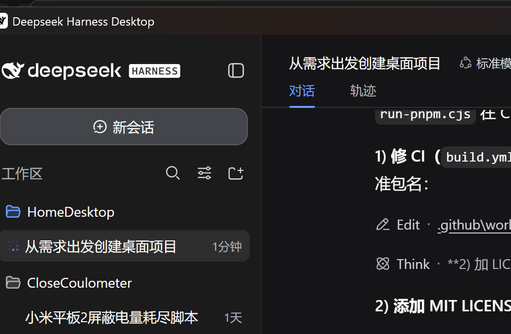

# HomeDesktop

跨平台（Windows / macOS / Linux）轻量级桌面启动器：像手机桌面一样管理"图标"——应用、文件夹、**插件小组件**（时钟 / 天气 / 日历 / 系统监控 / 待办）同屏混排，全屏 Pad 模式 + 全局热键一键唤出，支持本地插件市场与 zip 分发。

> 技术栈：**Tauri 2**（Rust）+ **Svelte 5**（TypeScript / Vite 6）



## ✨ 功能

- **手机式桌面**：图标 + 小组件同屏混排、多页滑动、文件夹、全局搜索（`Ctrl+Space`）
- **拖拽交互**：拖拽排序（鼠标 / 触屏长按）、拖入文件夹、拖到边缘翻页、跨页移动
- **尺寸**：1×1 基准的整数倍（⇲ 调整），小组件按插件声明提供多档尺寸
- **全屏 Pad**：`Alt+Space` 全局热键显示 / 隐藏，一键进入沉浸式全屏启动台
- **外观**：深 / 浅主题、背景预设 / 自定义颜色 / 本地图片壁纸、图标大小
- **系统托盘**：单击显示 / 隐藏，菜单快捷操作；**开机自启**开关
- **系统应用面板**：扫描注册表 + 开始菜单，显示系统真实图标，点击原位替换为应用
- **插件系统 v2**：
  - zip 插件包（根目录 `manifest.json`），应用内 ＋ → 安装 / 更新 / 卸载
  - **自定义 JS 小组件**：插件自带 `widget.js` 自定义元素，运行在 **iframe 沙箱**（`allow-scripts`，无同源权限），经 `window.__homedesktopPlugin` postMessage 桥访问设置与能力
  - **插件通知能力**：`bridge.notify(title, body)` → 系统右下角 toast（示例：倒计时到点通知，可关）
  - **本地插件市场**：扫描市场目录 zip 包，一键安装；**统一插件管理页**（已安装 / 市场双页签）
- **内置小组件**：时钟、天气（多城市实例）、日历、系统监控（CPU / 内存）、待办
- **数据**：布局 / 配置本地持久化（`layout.json` / `config.json`），**导出 / 导入备份**（覆盖 / 合并）

## 📖 文档

| 文档 | 内容 |
|---|---|
| [docs/PRD.md](docs/PRD.md) | 产品需求 |
| [docs/tech-selection.md](docs/tech-selection.md) | 技术选型 |
| [docs/architecture.md](docs/architecture.md) | 架构设计 |
| [docs/milestones.md](docs/milestones.md) | 里程碑（M0–M17 全部完成 ✅） |
| [docs/PLUGIN_API.md](docs/PLUGIN_API.md) | **插件开发者 API**（manifest schema / 小组件 / 桥 / 分发） |
| [docs/CHANGELOG.md](docs/CHANGELOG.md) | 变更日志（长期记忆） |

## 🚀 开发

```bash
# 依赖安装（Node ≥ 20.17；本机 Node 24 请用 corepack pnpm）
corepack pnpm install --store-dir .pnpm-store

# 开发运行（自动启动 Vite + Tauri 窗口）
corepack pnpm tauri dev

# 前端检查 / 测试
corepack pnpm check
corepack pnpm test
```

目录结构：

```
src/            前端（Svelte 5）
src/core/       核心：类型 / 状态 / 持久化 / 插件加载器 / 小组件运行时
src/components/ 网格 / 图标块 / 搜索 / 添加菜单 / 插件管理
src/widgets/    内置小组件（时钟 / 天气 / 日历 / 系统监控 / 待办）
src-tauri/      Rust 壳（命令 / 插件注册表 / 布局持久化 / 通知）
crates/         homedesktop-core（纯逻辑核心，可单测）
plugins/        内置插件（每插件一目录 + manifest.json）
plugins-dist/   示例插件 zip 安装包
docs/           产品与技术文档
```

## 🔌 插件开发

每个插件 = 一个目录 + `manifest.json`：

```json
{
  "id": "com.example.myplugin",
  "name": "我的插件",
  "version": "1.0.0",
  "type": "widget",
  "emoji": "🧩",
  "widgetComponent": "__plugin__",
  "widgetFile": "widget.js",
  "widgetElement": "hd-my-widget",
  "sizes": [{ "w": 2, "h": 1 }],
  "settings": [
    { "key": "target", "label": "目标秒数", "type": "number", "default": 60 },
    { "key": "enableNotify", "label": "到点通知", "type": "toggle", "default": true }
  ],
  "actions": []
}
```

- 小组件 JS 内可用桥 API：`getSetting(cellId, key, fallback?)` / `setSetting(cellId, key, value)` / **`notify(title, body)`**
- 分发：目录打成 zip（根目录含 `manifest.json`）→ 应用内 ＋ → 从 zip 安装；或放入本地市场目录
- 完整规范见 [docs/PLUGIN_API.md](docs/PLUGIN_API.md)，示例包在 `plugins-dist/`

## 📦 打包

```bash
corepack pnpm tauri build
```

| 产物 | 大小（Windows 实测） |
|---|---|
| NSIS 安装包 `HomeDesktop_*-setup.exe` | ~1.1 MB |
| MSI 安装包 | ~1.7 MB |
| 绿色版 `homedesktop.exe` | ~3.2 MB |

- 三平台（Windows / macOS / Linux）由 [.github/workflows/build.yml](.github/workflows/build.yml) 自动构建（GitHub Actions）
- Windows 发布版静态导入 `WebView2Loader.dll`，CI 构建前自动从 NuGet 拉取；NSIS 钩子（`nsis-hooks.nsh`）安装时复制到 exe 同目录

## 📄 License

[MIT](LICENSE) © 2026 Eggplant4363
